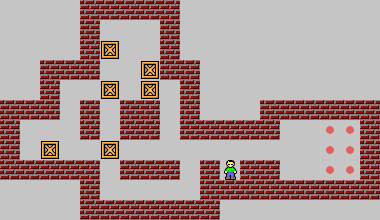

# XSB

(anian)

有个开源的推箱子程序叫做xsokoban。Unix平台的。看名字就知道了。是在x windows里面运行的。它是第一个推箱子程序利用现在认识xsb关卡格式。当然它没有给这种格式xsb的名字。这些关卡文件， 它叫做screen文件。也不知道是怎样开始流行起来的，但很多人后来做推箱子的关卡格式都是用这些符号。而且还给了个叫做xsb。xsb自然是指xsokoban格式了。

(以下内容为杨教授网站提取整理)

推箱子关卡一般用XSB格式来保存和交流

| 字符  |   含义  |
|:------|:--------|
| @     | 人 (man)  |
| +     | 人在目标点 (man on goal)  |
| $     | 箱子 (box)  |
| *     | 箱子在目标点 (box on goal)  |
| #     | 墙 (wall)  |
| .     | 目标点 (goal)  |
| -     | XSB格式空格代表“地板”，又因为连续多个空格在网页或即时通讯软件中偶尔显示有问题，也用“-”或“_”代替空格。  |

例子:

```
----#####----------
----#---#----------
----#$--#----------
--###--$##---------
--#--$-$-#---------
###-#-##-#---######
#---#-##-#####--..#
#-$--$----------..#
#####-###-#@##--..#
----#-----#########
----#######--------
Title: Classic level 1
Author: Thinking Rabbit
```

上面的XSB格式关卡就是下面的图片关卡



这是答案:

```
ullluuuLUllDlldddrRRRRRRRRRRdrUllllllluuululldDDuu
lldddrRRRRRRRRRRRRlllllllluuulLulDDDuulldddrRRRRRR
RRRRRllllllluuulluuurDDuullDDDDDuulldddrRRRRRRRRRR
uRRlDllllllluuuLLulDDDuulldddrRRRRRRRRRRdRRlUlllll
lllllllulldRRRRRRRRRRRRRuRDldR
```

答案是LURD格式。

- l 或 L ==> 左
- r 或 R ==> 右
- u 或 U ==> 上
- d 或 D ==> 下

小写字母是移动， 大写字母是推动。

参考杨教授的网站的博文: [XSB格式和LURD格式简介](http://sokoban.cn/xsb_lurd.php)
