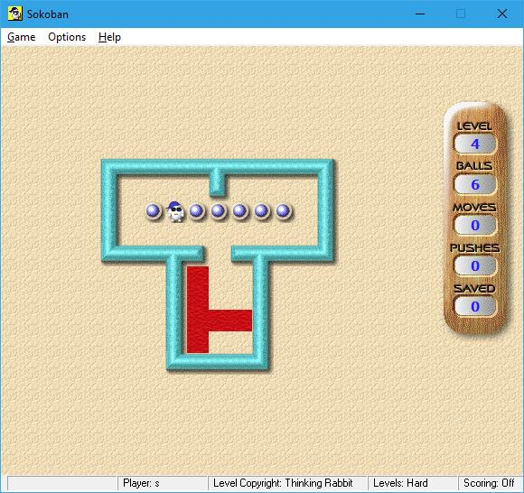
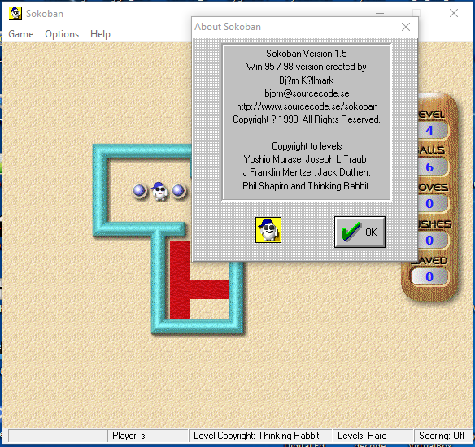

# 点推 (anian)

## 点推的历史

**anian 2020-08-20 22:04:09**  
关于“点击箱子然后它自己寻找路径可以拐弯的自动推动箱子”， 哪个程序开始先支持也没有确实的答案。

从我知道的全部推箱子里面， 应该是Sokoban For Windows v1.5 (1999年出版)。

作者Bjorn说了在v1.5之前的版本也有， 但它忘记了什么年份了。
我可以找到的最早版本就是v1.5。  
所以年份应该可能比1999年更早些。但没有找到比它更早的版本之前， 目前就只知道是1999年。

**愉翁 2020-08-20 22:08:19**  
点推

**愉翁 2020-08-20 22:08:30**  
这也是个概念

**anian 2020-08-20 22:08:32**  
虽然在版本v1.5它的方法慢， 但想法非常好。
我们知道就算在很多年后的3.0版本它用的方法还是很慢的。
我投诉了几次， 现在最新版本的3.3 (现在是build 7， 发了很多个版本， 肯定不止7个。  所以不太清楚它的build版本是怎样命名的)  现在路径的方法快了很多。

**anian 2020-08-20 22:09:27**  
这个就是v1.5， 你们可能也用过。

**anian 2020-08-20 22:10:03**  

**愉翁 2020-08-20 22:11:05**  
路径，可达位置，可达提示，箱子的可达位置，人的可达位置等

**anian 2020-08-20 22:11:58**  
程序没有介绍这个功能， 也没有显示路径。但你点击它就会推。

**anian 2020-08-20 22:14:24**  
xSokoban关卡文件的格式其实Thinking Rabbit也是知道的。
我怎么知道Thinking Rabbit知道关于xSokoban的格式？

如果你到sokoban.jp网站下载最新版本的推箱子 (side a, side b, revenge, smart，first step 任何一个)。

然后用7Z解压， 关卡文件就是保存在一个叫做XSOKOBAN的文件夹里面。
而且每个关卡的文件名字都是有“XSOKOBAN”。 如：IDR_XSOKOBAN_001

以前也看过有screen或者scr的， 但忘记了是在哪个Thinking Rabbit出版的推箱子里面看到的。

不知道谁是第一个用"XSB"这个名字。  虽然关卡格式是从xSokoban来的， 但LURD格式不是。xSokoban不是用LURD格式做答案。虽然类似但不是LURD。
它用  h, j, k, and l。 h = left, j = down, k = up,  l = right。
虽然也是记录了上下左右的资料但在xSokoban之前就已经有推箱子程序用LURD格式。

究竟是哪个程序开始先用LURD格式现在还没有答案。
只是知道1992年已经有推箱子程序用了。
