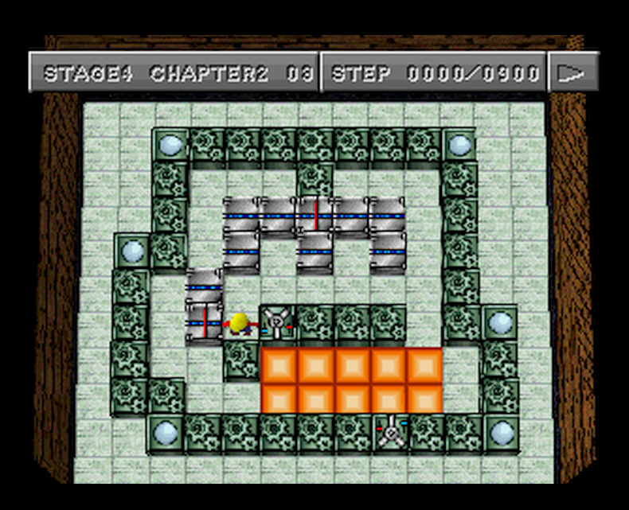

# plus格式

(anian)

plus格式其实就是xsb格式加多两行资料。两行的资料是给箱子和目标点不同的数字。相同数字的箱子必须推到相同的目标点才算过关。

箱子和目标点不一定要有数字。

之前我说的thinking rabbit关卡：



就这样看， 关卡是和平时相同。

但看仔细些就看到有点分别。

这两个地方：


想过关， 就要将箱子表面的“电路”图接通。

就是说， 这两个箱子必须推到这两个地方：


这样的要求，这个关卡就增加麻烦了。因为现在不止是简单的推箱子下来就可以。基本上指定了必须先填其中一个“+”字箱子。

SOKOMIND是第一个做出来支持箱子和目标点可以有数字，指定数字必须推到指定的目标点才可以过关。作者Gerald Holler给这种格式的名字是“SokoMind Plus”。

现在基本上大家都是叫做plus格式，或者Sokoban Plus格式。

上面说的这个的关卡，完全可以用plus格式来代表。

这样：

```
-#########-
-#---#---#-
-#-$$$$$-#-
##-$-$-$-#-
#-$------#-
#-$@####-##
#--#.....-#
##--.....-#
-##########
Title: Stage 4 Chapter 2 03 (step 0900)
Author: Thinking Rabbit
Comment:
boxorder  1 1 2 1 1 1 1 1 1 2
goalorder 2 1 1 1 1 1 1 1 2 1
Comment-End:
```

PLUS格式和平时的XSB基本上没有分别。

就是在`Comment:` 和 `Comment-End:` 之间增加了两行资料。

这两行资料是：

```
boxorder <给箱子数字命名资料>
goalorder <给目标点命名资料>
```

SokoMind Plus格式，作者用的数字是从1到99。

0没有用。大于99的数字也没有用。

99有特别的意义，就是代表不给箱子或者目标点任何数字。

就这样想。我们其实可以将上面的两行资料重新做，这样也可以：

```
boxorder  99 99 2 99 99 99 99 99 99 2
goalorder 2 99 99 99 99 99 99 99 2 99
```

最后面的如果是99，全部可以不写。

所以上面的和下面这个也相同：(就是goalorder最后的99不需要写)

```
boxorder  99 99 2 99 99 99 99 99 99 2
goalorder 2 99 99 99 99 99 99 99 2
```

如果是我设计， 我不会用99来代表不需要给箱子/目标点数字。

最自然的方法自然是用0来代表不给箱子/目标点数字。

这样也不会有现在98个箱子数字的限制。

除SokoMind (v3.4)程序支持Plus格式，SokoFan也支持。

SokoFan当然也用了boxorder和goalorder这两行资料。

但它不要求必须在comment里面。有这两行的资料就可以了。

下面说说这两行资料。

你看到的数字，就是关卡从左上角开始数，从左到右，从上到下这样数来给箱子或者目标点命名。

1到98的数字就是说，直接给数字。99就是说不给数字。

这个关卡：

```
-#########-
-#---#---#-
-#-$$$$$-#-
##-$-$-$-#-
#-$------#-
#-$@####-##
#--#.....-#
##--.....-#
-##########
Title: Stage 4 Chapter 2 03 (step 0900)
Author: Thinking Rabbit
boxorder  99 99 2 99 99 99 99 99 99 2
goalorder 2 99 99 99 99 99 99 99 2
```

这Sokofan里面显示是这样的：


2字箱子必须推到2字目标点，其它的箱子填其它目标点就可以了。

这样全部目标点填了就是过关。

SokoMind v3.4 看到相同的关卡是这样的。

资料必须写在comment里面：


有SokoMind的可以用下面这个测试：

```
 ######### 
 #   #   # 
 # $$$$$ # 
## $ $ $ # 
# $      # 
# $@#### ##
#  #..... #
##  ..... #
 ##########
Title: Stage 4 Chapter 2 03 (step 0900)
Author: Thinking Rabbit
Comment:
boxorder 99 99 2 99 99 99 99 99 99 2
goalorder 2 99 99 99 99 99 99 99 2
Comment End:
```

过关：


原thinking rabbit游戏， 过关是这样的：


用颜色也可以， 只是如果颜色超过3或者4种就不容易看了。

数字有数字的好。

有sokolor，也有blockoban。都是类似的想法。

thinking rabbit其实25年前就测试了几种不同想法的推箱子变种。

如一次推几个箱子，指定箱子推到指定的地方，有隐蔽通道，有鬼的箱子(或者目标点)，有会爆炸的箱子(如果爆炸就GAME OVER)，有限制步数，有限制时间，有连接电路图，有连接电路变成一个炸弹。

也有两人同时操作的推箱子(比赛模式)。
